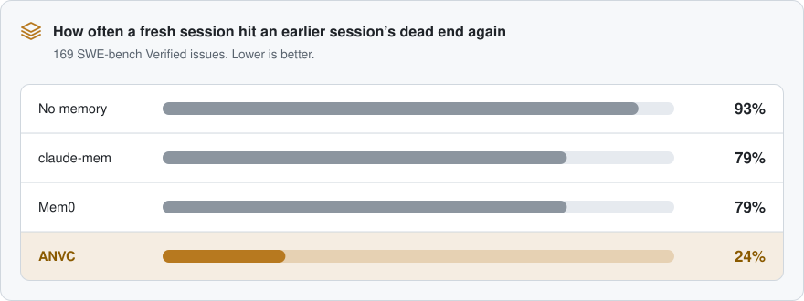

<p align="center">
  <picture>
    <source media="(prefers-color-scheme: dark)" srcset="docs/assets/wordmark-dark.svg">
    
  </picture>
</p>

<p align="center"><b>Agent-Native Version Control</b> for Claude Code, Codex, and Cursor</p>

ANVC is on a quest to eradicate the constant headache of agents not being able to maintain themselves over long-term projects. We're serious about making version control truly agent-native, so agents don't forget that an approach was already abandoned and why, lose the reasoning behind previous work, forget where numbers came from after months of work and multiple compactions, or waste hours and millions of tokens rebuilding context that already existed.

We've dealt with all of this ourselves. Dozens of markdown files that eventually stop being read or properly updated, failed approaches getting tried again, sources and results becoming disconnected from the work that produced them, important context disappearing between sessions, and plenty of other stupid shit that just gets worse the longer a project runs.

We're building ANVC for our own long-term coding and research projects too. We'll keep running it there, finding what actually helps versus what just adds more shit to maintain, and updating it until it's something we can't live without.

<p align="center">
  
</p>

<picture>
  <source media="(prefers-color-scheme: dark)" srcset="docs/assets/features-dark.svg">
  
</picture>


### Why ANVC and Not Simply Claude-Mem, Mem0, TierMem, Entire, or Others

To our knowledge, ANVC is one of the first systems to be serious about version-controlling agent work itself (each attempt is a record stored as a git ref next to your commits), beyond hosting improvements or only a few compressions, additional prose, or vague management.

You decide what gets saved, shared, or used by the agent (per project, per field, per record): sheepish about sharing prompts with coworkers, but want to automatically share more raw or important info, like your attempts and outcomes from sessions — ok, go for it. Don't want your agent to ingest captures from ANVC and only want to use them once a month when the agent chokes and can't remember anything — ok, go for it.

### Core Features (for now)

**Save Categories like Reasons, Outcomes, and ...** ANVC keeps failed and abandoned attempts (the type of work that just never gets committed to git itself), why they were dropped, the error, and the command needed to recheck whether the original failure still holds. Through this, we want to avoid having agents retry wrong actions, explore paths that lead to absolute dead ends, or misdirect their attention toward the wrong areas of the task. For instance, in our evaluation on 169 real SWE-bench issues, a fresh session hit an earlier session's dead end again in 93% of runs without ANVC and 24% with it.

**Automatic Capture and Retrieval ...** The agent doesn't have to be repeatedly instructed on how, when, or where to maintain dozens of .md files, simply for it to get lazy and stop updating them altogether. Because of hooks (Claude Code, Codex, Cursor), when a session starts, or the agent touches a file tied to an earlier dead end (aka a stupid mistake), it gets a small warning first, with more of the underlying history opened only if needed.

**Full Control over Saving, Sharing, and Context ...** Any and all separate fields of records (prompts, errors, decisions...) can stay local or get sent with git (as git refs, with no separate service involved), either fully or partially. You can control this per field, use private/shared tiers or presets, disable hooks entirely, and decide exactly what gets shown to the agent.

**WTF Happened to Numbers? ...** The story of how certain results (numbers, metrics, logic, system status) from long-running projects were obtained can often be completely forgotten by the agent despite having dozens of mds and saves (ANVC developers have had this issue dozens of times at this point). Instead of having it backtrack and waste time & usage, we connect those results back to the file, key, command, and inputs that produced them, flag them when those inputs change, and can check numbers or claims against the underlying result.

**A UI for all parts ...** It's a bit sloppy for now, but as we test more and see what actually helps us and is needed versus what is just extra info to bloat the visual...

<p align="right"><sub><i>(Everything above, em dashes included, were human-generated.)</i></sub></p>


## Preliminary Results

To see whether ANVC stops a newly launched agent session from repeating an earlier session's dead ends, we compared it with claude-mem and Mem0 on 169 real issues from SWE-bench Verified.

<picture>
  <source media="(prefers-color-scheme: dark)" srcset="docs/assets/results-dark.svg">
  
</picture>

claude-mem and Mem0 both compress sessions, which works well if it's a single continuous task requiring multiple compactions. However, ANVC is specifically tackling the headache of dealing with long-running projects. 

These results show that ANVC is capable of avoiding most repeated dead ends, and once a dead end costs hours instead of a few commands, avoiding repetition would save far more than compression.

## Install

You need [Bun](https://bun.com) and git.

Pick one way to install:

- If Claude Code is your only agent, use the plugin. You don't download
  anything yourself.
- If you use Codex, Cursor or more than one agent, use the clone.

Don't use both for Claude Code. If you do, ANVC records every session twice.

### Claude Code

1. In Claude Code, add the marketplace and install the plugin:

   ```
   /plugin marketplace add yodering/anvc
   /plugin install anvc@anvc
   ```

   If you reach GitHub over SSH, add the marketplace by its SSH address:
   `/plugin marketplace add git@github.com:yodering/anvc.git`.

2. Start a new Claude Code session to load the plugin. ANVC then records in
   every git repository that you open in Claude Code.
3. In your project, run `/anvc:setup`. Your agent shows each setting with the
   recommended choice. Pick your own choices or take the recommended ones.
   Before it turns on something that sends records off your computer, or
   that edits a file your project commits, it asks you. Then it offers to
   write the project's goals, and to connect ANVC to the writing rules in
   your AGENTS.md or CLAUDE.md.

To turn ANVC off in one project, run `/anvc:off` in that project.

### Codex, Cursor, or Claude Code without the plugin

```bash
git clone https://github.com/yodering/anvc.git ~/anvc   # or git@github.com:yodering/anvc.git over SSH
cd ~/anvc
bun install
bun run setup
```

Keep the `~/anvc` folder. Your agents run ANVC's hooks and tools from it.

Setup first asks whether you go through the settings or your agent does.
Then it asks:

- which agents to connect
- whether ANVC runs in every project or in one
- how much ANVC tells your agent
- who can read what ANVC saves

After setup, start a new session in your agent.

[All install options](docs/guide/install.md), including how to let your
agent do all of it.

### Open the work log

In Claude Code, run `/anvc:open` in your project. From the clone, give the
project's path:

```bash
cd ~/anvc
bun run anvc open --repo /path/to/your/project
```

The work log opens in your browser, and you are already signed in. Each
project has its own address, so you can open several at once. To open it in
the desktop app, add `--desktop`. The Update button at the bottom of the
sidebar installs new versions. The Questions page, also in the sidebar,
answers the first questions people ask, for example what leaves your
computer and how much ANVC writes to disk.

### Desktop app

The work log is also an app for macOS, Windows and Linux. To install it:

- Run `bun run setup`, which offers to install it.
- From a clone, run `bun run anvc desktop install` at any time.

Both install it for you alone, so neither asks for a password. Your agent
offers each new version.

To install it yourself, download the installer for your system from the
[latest release](https://github.com/yodering/anvc/releases/latest):

- macOS on Apple silicon: the `.dmg`
- Windows: the `-setup.exe`
- Linux: the `.deb` or the `.AppImage`

These downloads aren't signed yet. The first time you open the app:

- On macOS, choose Open Anyway in System Settings › Privacy & Security.
- On Windows, choose More info › Run anyway.

## The work log

**Settings.** Choose what each project saves and shares, field by field.


**Status and goals.** The Project page has four tabs:

- Status: what is in progress, what was done recently and whether it is in
  main, pushed or released, and what is next
- Goals
- Writing rules: where the rules for each kind of text are
- Tools: each agent's MCP servers, plugins, skills and hooks

Your agent gets all of it when a session starts, and again after compaction.
You don't have to ask it where things stand.


**Dead ends.** Before ANVC shows a dead end, it runs the dead end's check
command again, if it has one. It also shows what changed in the code since
then. The agent can then see when a dead end is no longer true.

**Where things came from.** Each result keeps its earlier versions. Lock the
versions that you publish. `bun run anvc check README.md` shows where each
number in a document came from. The Sources page keeps the pages, searches
and papers that your agent read, with the text it got back. The next agent
reads the kept copy and doesn't fetch it again.


**Project map.** ANVC draws it from your code's imports and your agents'
notes. It shows where attempts landed, and which descriptions are older than
the code.


## More

- [How it works](docs/guide/how-it-works.md)
- [Commands and agent tools](docs/guide/commands.md)
- [Private and shared](docs/guide/sharing.md)
- [Results](docs/guide/results.md)
- [Removing ANVC](docs/guide/removing.md)
- [Early experiments](archive/experiments/)
- [Development](docs/guide/development.md)
- [Contributing](CONTRIBUTING.md)

The code is under the Apache-2.0 license. The name ANVC is a trademark, so a
fork needs its own name. [TRADEMARKS.md](TRADEMARKS.md) says how you can use
the name.
