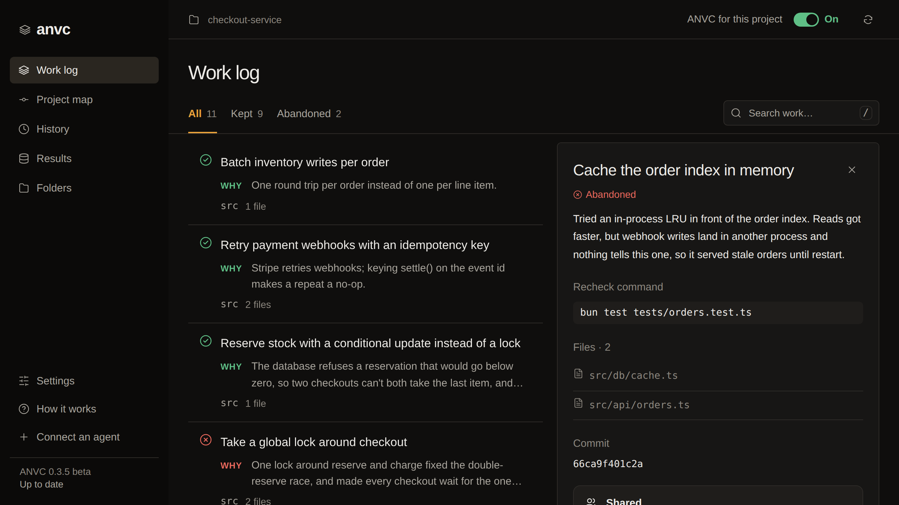
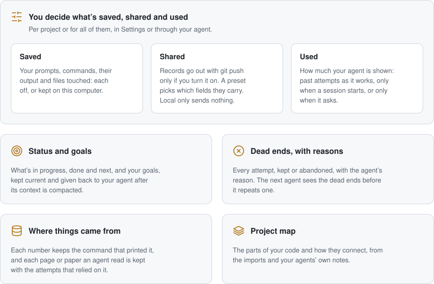
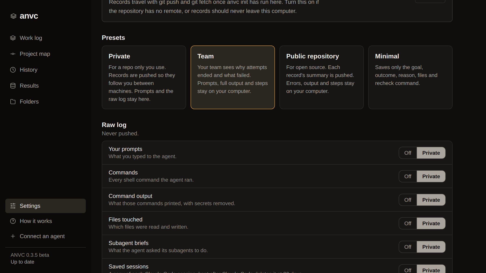
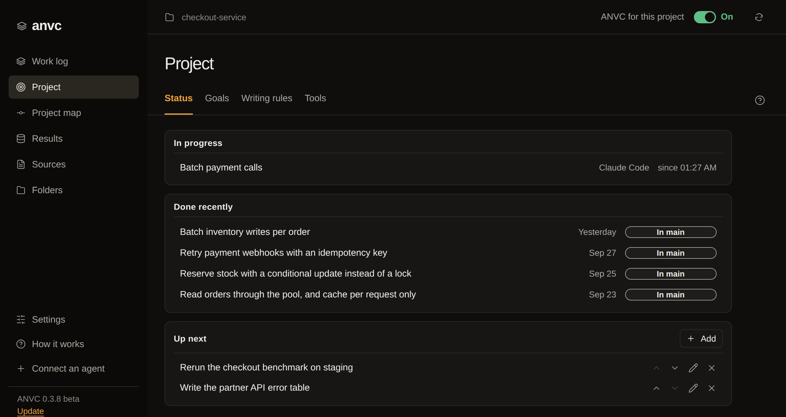
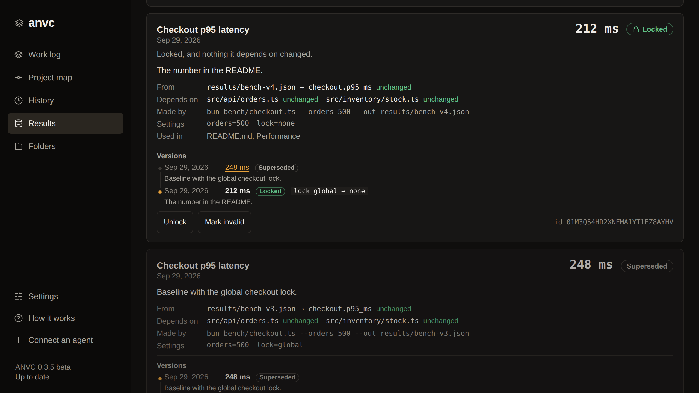
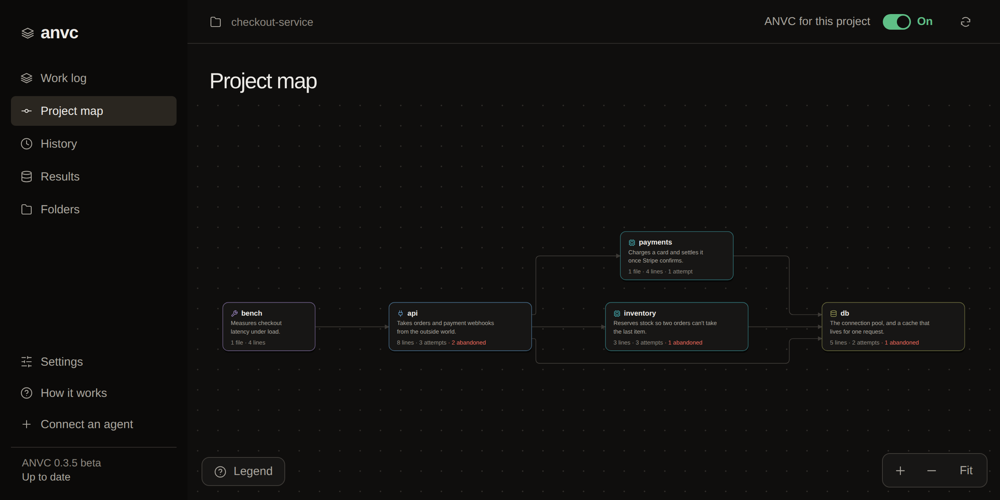

<p align="center">
  <picture>
    <source media="(prefers-color-scheme: dark)" srcset="docs/assets/wordmark-dark.svg">
    
  </picture>
</p>

<p align="center"><b>Agent-Native Version Control</b> for Claude Code, Codex and Cursor</p>

ANVC™ keeps a record of each attempt your coding agents make: what it set out
to do, whether it was kept or abandoned, and why. When the next agent starts
on the same code, it's shown the approaches that already failed before it
tries them again. Records are git refs next to your commits, so they travel
with push and fetch, with no server and no account.

<p align="center">
  
</p>

<picture>
  <source media="(prefers-color-scheme: dark)" srcset="docs/assets/features-dark.svg">
  
</picture>

## Features

- **Attempt history.** Each attempt's goal, outcome (kept or abandoned), reason
  and a command that checks it again.
- **Git-native storage.** Records are git refs next to your commits, versioned
  and shared with push and fetch. There's no server and no account.
- **Dead-end recall.** Hooks in Claude Code, Codex and Cursor show an agent the
  attempts that already failed before it tries them again.
- **MCP tools.** Agents search what was tried, record results and update
  goals and status through ANVC's MCP server.
- **Provenance.** Each number is traced to the run, command and files that
  made it, and `anvc check` does that for every number in a document.
- **Source capture.** The pages, searches and papers an agent read are kept
  with the text it got back.
- **Per-project policy.** Presets and per-field switches decide what's saved,
  what's shared and what the agent is shown. Passwords, API keys and tokens it
  recognises are removed first.
- **Work log.** Status, goals, a project map, results and sources, in the
  browser or a desktop app for macOS, Windows and Linux.

## Install

You need [Bun](https://bun.com) and git.

Pick one way to install. Use the plugin if Claude Code is your only agent;
there's nothing to download yourself. Use the clone for Codex, Cursor, or
several agents at once. Don't use both for Claude Code, or every session is
recorded twice.

### Claude Code

1. In Claude Code, add the marketplace and install the plugin:

   ```
   /plugin marketplace add yodering/anvc
   /plugin install anvc@anvc
   ```

   If you reach GitHub over SSH, add the marketplace by its SSH address
   instead: `/plugin marketplace add git@github.com:yodering/anvc.git`.

2. Start a new Claude Code session. Claude Code loads the plugin's hooks and
   tools when a session starts. From then on, ANVC records in every git
   repository you open in Claude Code.
3. In your project, run `/anvc:setup`. Your agent lists each setting with
   the recommended choice. Pick the ones you want, or tell it to use the
   recommended ones. It asks you before turning on anything that sends
   records off your computer or edits a file your project commits. Then
   it offers to draft the project's goals from its README, docs and code,
   and to point ANVC at the writing rules AGENTS.md or CLAUDE.md already has.

To turn ANVC off in one project, run `/anvc:off` there.

### Codex, Cursor, or Claude Code without the plugin

```bash
git clone https://github.com/yodering/anvc.git ~/anvc   # or git@github.com:yodering/anvc.git over SSH
cd ~/anvc
bun install
bun run setup
```

Keep the `~/anvc` folder: your agents run ANVC's hooks and tools from it.
Setup asks first whether to go through the settings with you or leave them
to your agent. Then it asks which agents to connect, whether ANVC runs in
every project or only one, how much it tells your agent, and who can read
what's saved. Start a new session in your agent afterwards.

[All install options](docs/guide/install.md), including having your agent
do all of it.

### Open the work log

In Claude Code, run `/anvc:open` in your project. From the clone, name the
project:

```bash
cd ~/anvc
bun run anvc open --repo /path/to/your/project
```

It opens in your browser, already signed in. Each project has its own
address, so several can be open at once. `--desktop` opens it in the desktop
app instead, once you've installed that. The Update button at the bottom of
the sidebar installs new versions, and the Questions page there answers what
people ask first, such as what leaves your computer and how much it writes to
disk.

### Desktop app

The work log also comes as an app for macOS, Windows and Linux. `bun run
setup` offers to install it, and from a clone `bun run anvc desktop install`
does it any time. To install it yourself, download the installer for your
system from the [latest release](https://github.com/yodering/anvc/releases/latest):
the `.dmg` for macOS on Apple silicon, the `-setup.exe` for Windows, and the
`.deb` or `.AppImage` for Linux. It isn't signed yet. The first time it opens,
macOS blocks it until you choose Open Anyway in System Settings › Privacy &
Security, and Windows asks you to choose More info › Run anyway.

## What you get

**You decide what's saved, shared and used.** Each part of the raw log, such
as your prompts, the commands your agent ran and what they printed, is off or
kept on this computer. Records go out with git push only once you turn that
on, and a preset picks which fields they carry. Local only keeps everything
on this computer. How much your agent is shown is up to you: past attempts as
it works, only when a session starts, or only when it asks.



**Status and goals.** The Project page has four tabs. Status shows what's in
progress now, what was done recently and whether it's in main, pushed or
released, and what's up next. Goals holds the project's goals and sub-goals,
Writing rules says where the rules for each kind of text are written, and
Tools lists each agent's MCP servers, plugins, skills and hooks. Your agent is
given all of it when a session starts and again after its context is
compacted, so you don't have to ask it where things stand.



**Dead ends, with reasons.** Every attempt, kept or abandoned, with the
reason the agent gave. Before a dead end is shown to an agent,
ANVC runs its test command again when it has one, and shows what changed in
the code since, so the agent can tell when a dead end no longer holds.

**Where things came from.** The numbers your project relies on, each with
the file and command it came from, what it depends on and its earlier
versions. Lock the ones you publish. `bun run anvc check README.md` goes
through every number in a document and says where each one came from. The
pages, searches and papers your agent read are kept on the Sources page with
the text it got back, so the next agent reads the kept copy instead of
fetching it again.



**Project map.** The parts of your code and how they connect, drawn from its
imports and your agents' notes, with where attempts landed and which
descriptions are older than the code.



## More

- [How it works](docs/guide/how-it-works.md)
- [Commands and agent tools](docs/guide/commands.md)
- [Private and shared](docs/guide/sharing.md)
- [Results](docs/guide/results.md)
- [Removing ANVC](docs/guide/removing.md)
- [Early experiments](archive/experiments/)
- [Development](docs/guide/development.md)
- [Contributing](CONTRIBUTING.md)

The code is Apache-2.0. The name ANVC is a trademark, and a fork needs a name of
its own: [TRADEMARKS.md](TRADEMARKS.md) says how the name can be used.
